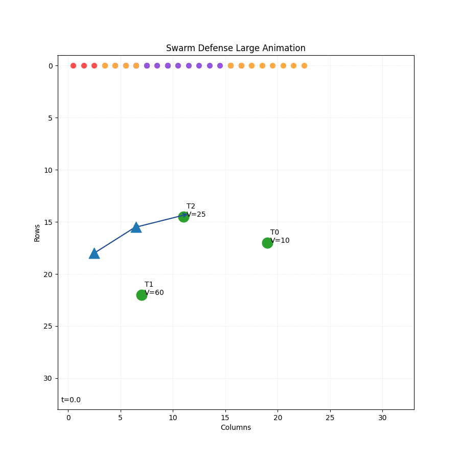
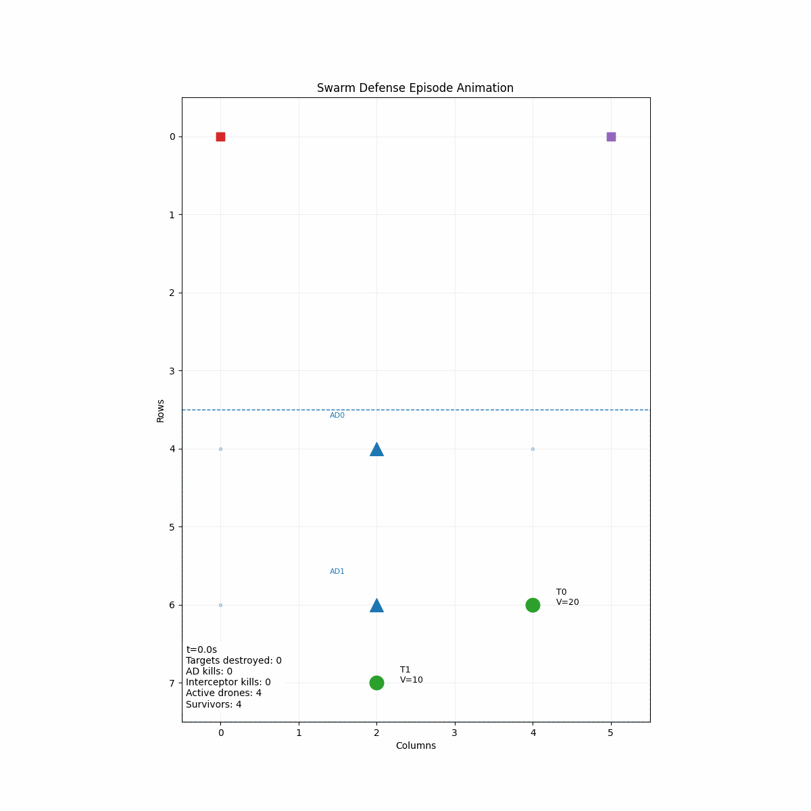
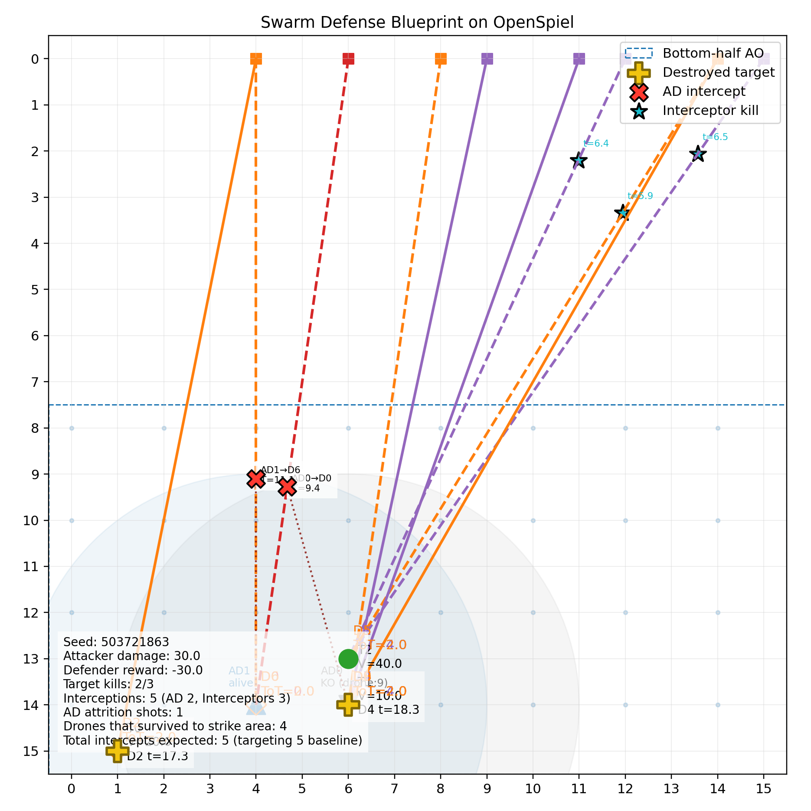

# ESCHER-Swarm-Solver

**ESCHER-Swarm-Solver** is a comprehensive framework for solving and analyzing large-scale Swarm Air Defense scenarios using the **ESCHER** (Efficient Sampling of Checkpoints for History-based Equilibrium Recovery) algorithm.

This repository contains the game environments (built on [OpenSpiel](https://github.com/deepmind/open_spiel)), the solver implementations (PyTorch), and visualization tools for analyzing strategies in both abstract and high-fidelity continuous environments.

## 🎥 Demos & Visualizations

### High-Fidelity Swarm Defense
A continuous, non-abstracted simulation with 40 attackers and 20 interceptors.


### Abstract Strategy Visualization
Visualizing the decision-making process in the discrete OpenSpiel environment.


### Blueprint Analysis
Static analysis of engagement outcomes, showing drone paths, intercept points, and coverage.


---

## 📚 Documentation

We have detailed internal documentation explaining the theoretical foundations of the solvers used in this project:

- **[Guide to ESCHER](docs/escher/GUIDE%20TO%20ESCHER.md)**: An in-depth explanation of the ESCHER algorithm, its advantages over MCCFR, and how it handles large imperfect-information games.
- **[Guide to CFR](docs/cfr/GUIDE%20TO%20CFR.md)**: A primer on Counterfactual Regret Minimization, the foundational algorithm for solving extensive-form games.

---

## 📂 Repository Organization

The project is organized into several modular components:

### 🧠 Solvers & Algorithms
- **[ESCHER-Torch](ESCHER-Torch/)**: A PyTorch reimplementation of the ESCHER algorithm. It includes the core solver logic and scripts to run it on standard OpenSpiel games (like Leduc Poker) and our custom Swarm environments.

### 🎮 Game Environments
- **[Swarm-AD-OpenSpiel](Swarm-AD-OpenSpiel/)**: The core sequential, two-player OpenSpiel environment. It models a 10-drone swarm vs. a layered air defense system (autonomous launchers + interceptors) on a discrete grid.
- **[Swarm-AD-Large-OpenSpiel](Swarm-AD-Large-OpenSpiel/)**: A high-fidelity variant designed to stress-test strategies. It features 40 attackers, continuous space movement, directional AD behavior, and RRT-based pathfinding.

### 🛠️ Tools & Visualization
- **[Swarm-AD-Naive-Strategy](Swarm-AD-Naive-Strategy/)**: A simplified runner that wires blueprint strategies directly into the OpenSpiel game for quick visualization and debugging.
- **[Visualizer](Visualizer/)**: A standalone package for generating Cursor-on-Target (CoT) events to visualize game states in **WinTAK**. It also handles the generation of the GIFs shown above.
- **[WinTAK-CoT-Generator](WinTAK-CoT-Generator/)**: Utilities for generating CoT sequences for integration with tactical situational awareness tools.

---

## 🚀 Quick Start

### Running the ESCHER Solver
To run the solver on the standard Swarm Defense game:
```bash
cd ESCHER-Torch
python run_escher_torch_swarm.py
```

### Visualizing a Strategy
To generate a visualization of a blueprint strategy:
```bash
cd Swarm-AD-Naive-Strategy
python run_blueprint_demo.py
```
*Check the `output/` directory for the resulting PNG.*

### Running the Large Scale Simulation
To run the high-fidelity simulation and generate an animation:
```bash
cd Swarm-AD-Large-OpenSpiel
python demo_animation.py
```
