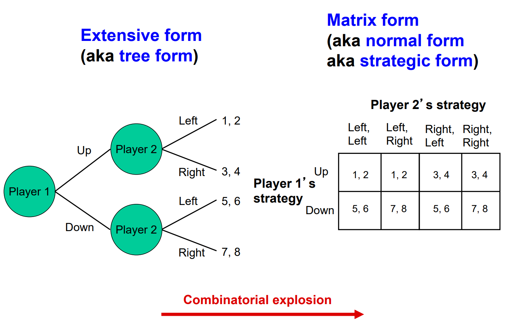
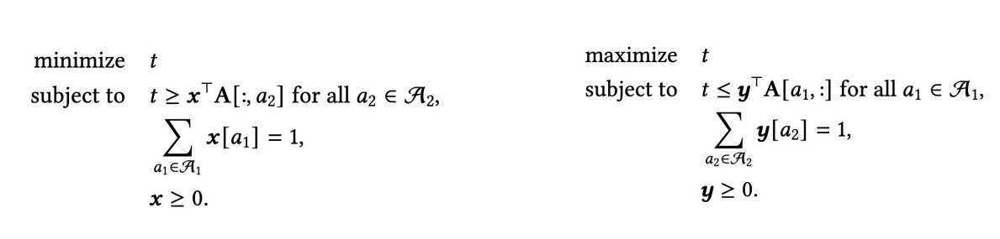
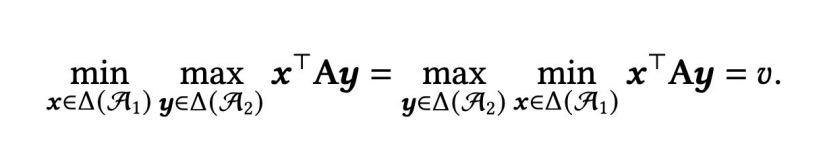
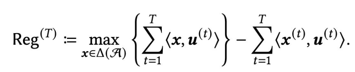
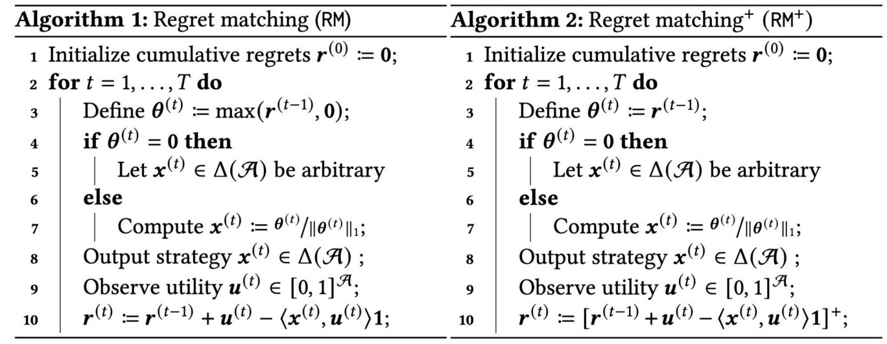
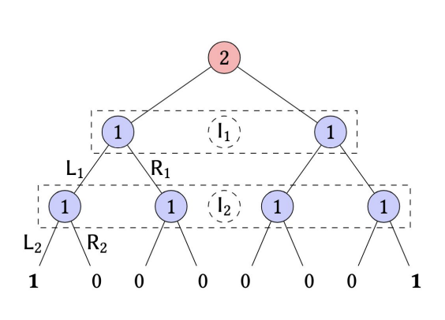
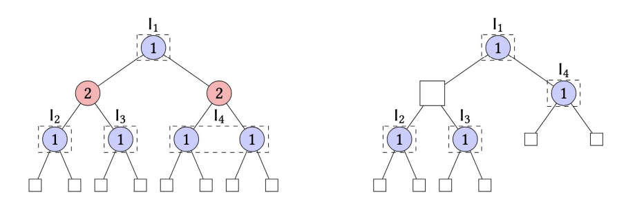
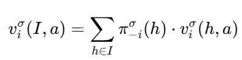
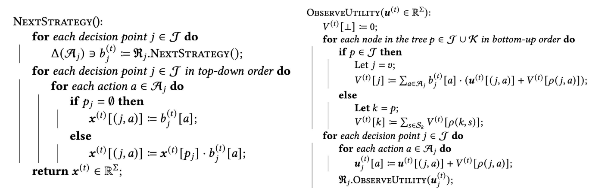

# Explaining Counterfactual Regret Minimization

### Disclaimer

Plenty of important game theory will be skipped over in order to get a not-overloaded explanation of CFR that would allow implementation. Also may be a few mistakes, as I am not an expert. The goal of this is to give the *bare minimum* background and baseline knowledge to understand the motivation behind and how to use CFR. The algorithms behind *Libratus* and similar SOTA game-solvers are significantly more complex and not publicaly available, though their general architectures are, and require more in-depth knowledge.

These are all adapted from the lecture slides and notes at [15-888: Computational Game Solving](https://www.cs.cmu.edu/~sandholm/cs15-888F25) taught by Prof. Tuomas Sandholm and Ioannis Anagnostides. A further breakdown of each concept can be found there.

## Introduction

### Nash Equilibria

#### Players and Utilities
In game design, the following terms are interchangeable - agent and player, action and move. Typically, we use the term **player** and **action** when we discuss the formulation of some of these moves.

#### Game Representation

Taken from [the lecture here](https://www.cs.cmu.edu/~sandholm/cs15-888F25/Lecture_1_Introduction.pdf)

There are generally two forms of representing games. The left side is the traditional turn-based variation, Player 1 makes an action, Player 2 makes an action, etc. The right side is normal form, which usually represents *simultaneous* action, that is, both players decide at the same time with the outcome determined there. That being said, these aren't rigid definitions - these are good for visualization, but we can have extensive-form games with chance players/effectively simultaneous play, we can have normal form games where it's sequential. But for visualizing, these are generally the two ways we approach game solving.

The important thing of note is that each player sees a *game state* or *node*, and plays an action depending on what it sees. We can then call this a **strategy**.

#### Strategies and Equilibria

A **strategy**, then, is the mapping of the history (what the player has seen before in the game/the player sees now), to actions. We can denote a **strategy** as **si** and therefore the set of available strategies to the player as **Si**. 

Furthermore, a game is comprised of each player playing their own strategy. We can refer to this as a **strategy profile**, **s***, or for each player, what strategy they chose to use.

Now we can proceed onto **utilities**. In economics, the utility **ui** function can of course be dependent on risk aversion, marginal value, etc, but for the sake of pure game theory, we typically just use EV (expected value). That being said, changing your utility function may prove useful in different experimental contexts. Players will always choose to **maximize** their expected utility. A standard rigid measure of utility is the value at the end of the game. For instance, in poker, the amount of money you've gained is certainly one way to measure utility. Similarly, the amount of money you've lost is also a utility in some form.

Now that we have a strategy profile **s***, we can say that its in a *Nash equilibrium* if there's no incentive for anyone to deviate, **given** nobody else deviates. Basically, if you're a player in a Nash equilibrium, there would never be a gain by switching to doing something else. 

There are some caveats. One is that depending on the game, there may be multiple Nash equilibriums, or none. In some games, there may always be "perfect counters", which causes no Nash to exist, because you are always incentivized to switch strategies.

### Imperfect Information Games

Chess, Checkers, Go, etc, are all examples of perfect information games. You can see the board, everything your opponent does is very clearly laid out in front of you, with no hidden information. The focus on our algorithms, and ESCHER is specifically to tackle the **imperfect-information game**, where we have deception, have private information, bluffing, etc. Diplomacy, Battleship, and Starcraft II are good examples of "game" games that are classified as imperfect-information.

*The applicability to the real world is much better if we solve imperfect-information games*. Auctions, negotiations, card games, military spending, cybersecurity - these are all imperfect information. So, we're going to need to define a few new terms to handle imperfect information games.

#### Mixed and Behavorial Strategy
A **pure strategy** is if you play something that is deterministic, e.g. I will always play rock, I will always play scissors. This obviously has a flaw - if you know your opponent will always play rock, just play paper 100% of the time.

So a **mixed strategy** is a probability distribution over pure strategies. For instance, a Nash equilibrium is that for rock-paper-scissors is playing rock, paper, or scissors each at 1/3 probability for both players. 

Now, a mixed strategy doesn't actually inherently "subscribe" or take into account the information at the current game state. It just randomly picks a given pure strategy to follow at any time. Of course - it can still make good decisions depending on how good the pure strategies are within it and how they're weighed, but its not actually doing anything substantial with the information that isn't immediately passed down to the randomly chosen pure strategy to discern. But we have another problem - for an imperfect information game, what game state are we *really* at?

To approach this, let's define an **information set**, or **infoset**. If you drew out a game tree, a game state is a node of your tree. To use chess as an example, think of an game state as the current chessboard, complete with all the chess positions, etc. Mathematically, it's just a vector, or a sequence, or however you want to visualize/define it. The problem is, for imperfect-information games, you don't have all the information. So rather than trying to figure out all possible game states, we define the set of *possible* game states in an **infoset**, which is essentially what you know at the current moment. 

To give an example of an **infoset**, let's take the example of Battleship. An infoset would be the squares you've already tried, and the hits/misses scored. This contains not just what you know for sure, but a solid probability over every possible real game state. Mathematically, we can represent the infoset in many ways, but we can generally express it as a vector. The dimensions/properties of the vector, however, can depend on the game.

We can now solve the previous problem. Rather than sampling over pure strategies, we instead sample our *actions* from our *infosets*. So, given an infoset, we have a probability distribution of actions to take, with better actions given higher weight. This is known as a **behavorial strategy**. There's a neat trick here - Kuhn's Theorem states we get equivalent payoff to a mixed strategy with one small caveat, which can be explained later.

With these defined, we can begin tackling the properties of games themselves.

## Two Player, Zero Sum-Games
The game that ESCHER, CFR, etc like to focus on are two-player, zero-sum games. Two-player isn't necessarily two-players, of course, it could be two distinct teams, as long as the teams are perfectly coordinated, since our theories account for reductions to player state. Furthermore, zero-sum implies a pure adversarial game, but it does not imply that if both players play perfectly, the game score comes out to 0. It just means that one player is the minimizing player, and one player is the maximizing player.

### Minimax

So, what is the game value then (the score if everyone plays optimally)? It's the minmax problem, specifically:

**v = maxxminyu1(x,y)**

The order of x and y are irrelevant. von Neumann proved that 

**maxxminyu1(x,y) = minymaxxu1(x,y) = v**

which basically means that it doesn't matter who selected their strategies first, the game value is still the same. This is the minmax theorem.

So now we have a note thanks to this theorem - if we play optimally, even if our opponent knows our strategy, we will always get at least the game value. But if we ever deviate from Nash optimal play, we get something called **exploitibility**, which means that there's now a vulnerability. That's the key problem behind ML, RL, or Gen AI -> they're all trained on non-equilibrium strategies, thus, they all have a degree of exploitability.

This leads us to the **safety property** - if our opponent deviates from what we believe to be the optimal strategy, they only hurt themselves. This is pretty central to our whole concept - a game-theoretic optimal strategy will pretty much always guarantee a gain or at least par in multi-step imperfect-information games.

#### Quick Aside: Using Linear Programming
With our central equation in mind, we can begin trying to compute *exact solutions* to games. 

The left side refers to the row player. For reference, the row player refers to the rows matrix form of the game, seen in the previous image, and the column player to the columns. While the previous image represented a non-zero-sum game, you can substitute with a single number of positive or negative value, which you can think of as the value of the outcome of that decision.

Linear programming duality implies that we can put this in the following form:

Which proves there's a polynomial-time algorithm for finding Nash equilibria. Unfortunately, when nodes begin to expand exponentially, such an approach doesn't necessarily work.

## Regret

### Defining Regret
So, what can we do? We want a measure of performance that can get us to something that is optimal. We know that for all players, we want to maximize our utility. 

For this, we can take an online learning approach. Let's assume we start with a mixed strategy, and play our a few rounds of the game. We can then measure the utility, given as **<x(t),u(t)>**, where **x(t)** represents our **strategy vector**, aka, the set of actions at that specific node, which can be represented as a convex set. **u(t)** is our **utility vector**, which has one utility value for every action represented within the strategy vector. This is a bit tricky to parse, but in short, if we decided to play out the whole game using some mixed strategy, given by **x**, which is really just a bunch of actions, then at the end of our actions, we can rate how "good" the action is by the utility gained. 

The general idea here is that we have a way of measuring how "good" a game state is through utilities, which can be defined depending on the game definition (computing utilities will come later). We can then have a way of pairing utility gains to actions, which allows us to build up a game representation that lets us evaluate and compare actions to be taken.

We can now define regret. Regret is defined as:

What this means is that regret is defined as the difference between the action you *wish* you took *in hindsight*, instead of the action you actually took. In other words, the better action to take at that time was action *a*, but you actually took action *a'* according to your mixed strategy, which incurs regret. We then have cumulative regret, which is, for an action *a*, how much better it would've been to take action *a* over all other actions prescribed by the mixed strategy. The hindsight part is important - it asks what would of happened if your strategy specifically consistently decided to *deviate at this specific point*. 

To use chess as an example, let's assume you moved a pawn on the rook file as your opening move (this is generally considered one of the worst opening moves). In comparision, a good opening move would be pawn to e5 (center file). Then, if we compared the utilities of the two, evidentally the better move accumulates positive regret.

Conceptually, we then get the following idea: the actions that have accumulated the **highest** regret are the actions that we *wished* we had taken the most. When we continue the online learning phase, we should therefore *increase* the probabalistic weight of choosing these actions and update our mixed strategy to reflect that. This is the central idea behind **regret matching**.

In our prior chess example, on the next iteration of our strategy, we would be probalistically incentivized to choose the good move, that is, explore pawn->e5 as the next possible area.

### Regret Matching

A quick aside before we begin regret matching - regrets can actually be negative! In this case, it just means that that action would be worse than our current action (and thus, those actions would be pruned out over time automatically).

These are the two algorithms typically used for regret matching. At any rate, you instantiate an arbitrary mixed strategy, and then continue iterating and updating your strategy, employing **self-play** with two players on the entire game with their strategies. As you run it for many iterations, you will first measure the regret, and as you continue to play, the regrets will converge toward zero, or what we call **no-regret**.

If both players have **no-regret**, then the average strategies (the strategies generated by regret-matching), converge to a minimax equilibrium, aka, Nash.

There's one more thing of note about these algorithms - one is that negative regrets are automatically clipped to 0 at the end of each iteration in RM+, while negative regrets are preserved in RM. This actually leads to substantial speedup in RM+ without the loss of guarantee of optimality.

## Counterfactual Regret Minimization

### Recap

Let's review all the elements now that have been brought together.

The above is our representation of an extensive form game, where we have the terminal values (ending state) of the game. Up until now, we've only been able to define utilities as the gain at the end of a game/round. But, when we do game solving, we should definitely be able to represent utilities during the midgame, and then the early game, no?

Furthermore, at each node, we're only going to really have an *infoset*, which is the set of all nodes that we could possibly be at in the real game, but we're unable to distingush due to incomplete information that we can see. 

Let's say we tried to do the above LP approach to compute an exact solution. To create an LP, we need to convert this tree into a matrix representation, so that we could then do LP to maximize the row/minimize the column player. The question is, how big is this matrix?

If we did a mixed strategy, and decided to mix over the probability of that entire infoset, then it follows that the size of that matrix would scale by the **products** of the infosets at *each layer of the tree*. And if it scales by the product of the infosets, then what we have is *combinatorial blowup* in the exponential degree. 

Well, this clearly doesn't work for any game of non-trivial size. So what can we do?

### Decomposition

First things first, let's assume that *every other player is fixed*. Let's try to optimize our own utility first.

Well, we know that at each **infoset**, there had to be some **sequence** that led to that infoset. Then, since these sequences are unique, we can construct a vector called a **sequence-form strategy**. To simplify, think of it as if the game ended up here, with both of us taking this set of actions, then for me, this is the set of actions that I could mix over. So, it's an expansion on the previous idea of a behavorial strategy, which just takes into account the current infoset.

How does this help?

At the end of the game, we get an accurate measure of the utility - that is, the final score of the game. But what about the action right before the ending? 

If we took the final action to end the game with 100% probability, then the utility of that action should be equal to the action at the terminal node, aka the end of the game. If we had a 50% chance of winning and 50% chance of losing, with winning being worth 1, and losing being worth 0, then by expectation, that node would be worth 0.5.

But how do we address what the opponent does? Well, we assume that *every other player is fixed*. So rather than forming the game on the left, we instead form the game on the right, where we have **decision nodes** and **observation nodes**, where we take actions at the decision node, and we observe what happens based on the other player's fixed actions at the observation nodes. In short, we act at a decision node, and we observe a *signal* at an observation node. To take Battleship as an example - at each decision node, we choose where to shoot, and at the observation node, we see where the opponent shot based on a fixed strategy.

At any rate, this illustrates how we get a utility for a place that isn't the terminal, or end of the game. Since we can now get a utility at an infoset, we can now begin to compute regret at specific actions and infosets, which is key toward how we begin to solve larger games.

#### Counterfactual Utility

One more final thing. To elaborate more on the utility, we need some way of weighting what the opponent and chance might do for us to get to that node. So, when we actually compute utility, we need to weight by the probability. So, to get the **counterfactual value**, aka our utility at that point, we employ the following equation:

To simplify, this is just saying that from the infoset ***I***, we just say that the counterfactual value of taking the action *a* is equal to the probability of the observation node in the next layer multiplied by the utility of continuing to play out the rest of my strategy, which we then sum over all possible observation nodes.

The *h* term here refers to the opponent's history, not ours. It's essentially saying that these are the set of opponent histories that would lead to this specific infoset I, so the nodes represent the possible true game state. This is perhaps the most interesting part of the entire counterfactual utility calculation - because you may note that *our* own history is irrelevant. 

Specifically, counterfactual utilities assert that the sequence of actions you took are irrelevant - rather, the infoset, and solving at the infoset itself is what actually matters. You then weight it by the reach probability, giving you the correct distribution of what your opponent would do, and how important/valuable certain game states are. .

The only thing that matters is the actions you can take next -> aka, calculating the **local counterfactual regret**, which we already know how to do through **RM** or **RM+**. This is where the prior emphasis on *hindsight* is important - this is why it's called *counterfactual regret*, because you're not actually asking whether or not one action is "objectively" better than the other, you're asking what the value is if you consistently deviated at this point, and play it out - "counterfactual". This allows you to explore optimal actions without ever reaching that state and minimize global regret, which converges to Nash equilibria.

### Counterfactual Regret Minimization

So, how do we calculate it then? Let's initialize a basic strategy randomly, or take on an existing strategy and plug it in - regardless of what we initialize with, it will converge to an optimal strategy. 

Then, we play out the whole game, which will get us to different terminal nodes/ending states of the game. We've obtained the **utilities** at the end of the game. From the terminal nodes, we go back up inductively - all the way back to the start of the game. For each infoset, we use the above strategy of counterfactual values - computing the probability, and multiplying it by the utilities. 

And wait a minute -> now, we have utilities at each infoset! They might not be 100% accurate yet, but with these utilities, we can now **compute the local regret**. So, we go ahead and do that for all the infosets.

And now that we have the **local regret**, we can update our strategy using any **regret matching algorithm**, e.g. RM, RM+, or some other variation. So now, we have a new strategy that is an improved variation of our older strategy!

And so, with our new strategy -> we go back through the tree again, and play out another game, starting our next iteration, and the cycle starts again.

At this point, you might notice something about the framework. Conceptually, we're really just doing a *forward pass* and a *backward pass*, similar to a neural network, but without the same structure. The forward pass in this case is us playing through the game using our strategy, and seeing which infosets we'll uncover and what we think is the best actions. The backward pass is us propogating the counterfactual values back up the chain to give us an accurate assessment of our regrets. Over time, the regrets should be minimized as we continue to iterate.

This is the basis behind **counterfactual regret minimization**, which is *the* algorithm behind how we optimally solve games. CFR is guaranteed to converge to a Nash equilibrium purely through self-play. Below is the actual algorithm:

Within here is the *real power of CFR* - it takes that normal form game that we tried to solve with LP earlier, and rather than operating in exponential time, we've reduced it to a **polynomial time** algorothm.

#### Caveats

CFR was actually introduced back in 2007 by Zinkevich et al. - but the modern sequencing methods that allow us to examine sequence-form games at scale was more explored by Farina et al. 2019 to get us within the computable realm. That being said, CFR was considered, and still is considered SOTA for game-solving.

The reason had to do with how we were able to compute the decomposition - while I won't get into the specifics here, previously the convergence speed was O(T-1/2), but with Farina et al, we get something on the order of O(T-3/4). This is done using the framework of *regret circuits*, which allows us to decompose the overall CFR into *independent* subproblems of manageable size. (I am skipping a lot here)

In addition, there are many CFR algorithms and variations that change the minimizer, the regret calculator, etc, each with different pros/cons.

Secondly, the question may arise as to how we actually achieve a good strategy if we fixed out opponent's strategy? The answer is simple - we initialize two CFRs, one for each player, and alternate or simultaneously update their CFRs.

**CFR is the basis behind *Libratus*, the best poker-playing bot in the world. That being said, that specific variation of CFR, and how we begin to scale CFR, is to be covered in the ESCHER guide.**