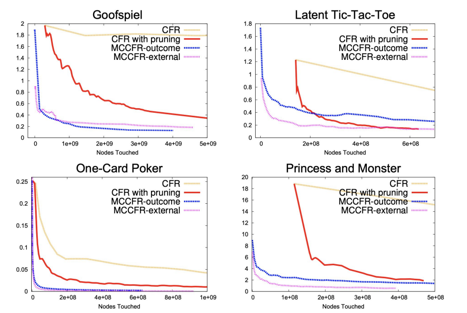
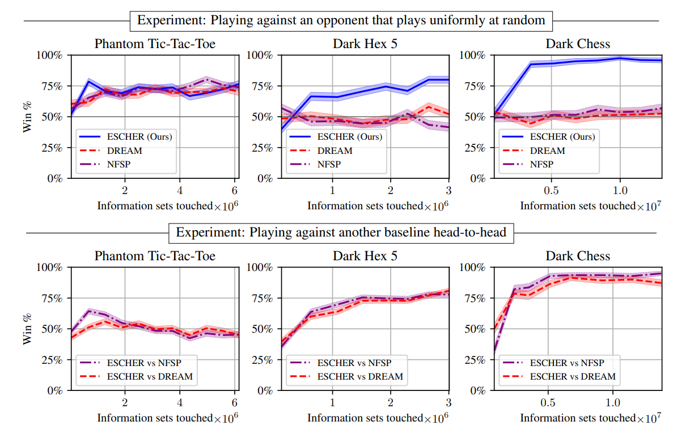

# Getting to ESCHER

### Limitations of Standard CFR
CFR is inherently a *tabular* algorithm - what this means is that to evaluate CFR precisely, all possible situations/reactions are needed for an ideal Nash to be played out. While each iteration can be done quickly, some games grow far too large in size to be evaluated in the basic form of CFR. For instance, heads-up no-limit Texas hold'em poker, considered the benchmark for AI in imperfect-information games and the "purest" form of poker, contained 10161 possible situations *for a single round.*

So, we have to accept some degree of suboptimality to increase our performance. But, there are still guarantees that we can anchor on, that still make our algorithms excel at their intended tasks, while giving us a solution that is rooted in game-theoretic behavior, and thus the strategies that are generated follow that model to some epsilon error.

## Stochastic Regret Minimization and Monte Carlo CFR
As a reminder, CFR relies in computing the utility at each node, which requires the full forward and backwards traversal for us. And, even if we had every single utility, we would still need to compute the counterfactuals, and perform updates to our regret minimizer, which still requires further traversals.

But, what if instead of computing the *exact* utility, we instead *estimate* the utility? 

The idea behind estimating is creating something that is computationally cheap and sparse - something that can run quickly, and something that doesn't have to visit the entire game tree to get ourselves an algorithm that works in most situations. We will cover two distinct ways of performing estimation.

#### External Sampling
Recall that in standard CFR, we expand the nodes of both players, and sample over all possible actions as we compute the exact utility vector needed. We know that with our existing techniques, this scales in *polynomial time*.

But what if instead, we just sampled independently a *pure strategy* (recall: deterministic) of the opponent? This is the basis behind **external sampling**. Now that we're only sampling the pure strategy, we've reduced the opponent's nodes to *linear* time. For ourselves - we still branch over all actions, but now we've reduced the infosets we need to explore significantly, reducing the overall space to a small fraction.

#### Outcome Sampling
We can go even cheaper than external sampling - let's just sample the *outcome*, or the terminal node of the game, and instead of doing all actions like external sampling, we just sample everyone. From there, we only propogate along the *path*, or *sequence* to the root (so essentially drawing a single line/path). Now, we have utilities that are *linear* with respect to the depth of the game, and only update the infosets on the direct path to the end of the game. The drawback of this approach, however, is the significantly increased variance compared to the true utility of the nodes.

#### Estimator Bias
External sampling produces what is known as an **unbiased estimator**. Essentially, while the estimator may have variance from the true value of the utility, it is inherently unbiased. This means as we sample more and more nodes (let more iterations happen), then we approach the true utility - we just reduce the variance at each iteration. 

Outcome sampling has a higher variance, which is why its input contains what's known as an *importance sampler*. The critical aspect to making outcome sampling viable is to select a balanced strategy that allows you to visit as many nodes as possible - this theoretically can reduce the variance, which minimizes the iterations needed to converge to a viable strategy. (The idea of importance sampling will be seen again in ESCHER)

### Monte Carlo CFR (MCCFR)
So, knowing both external and outcome sampling, we can rewrite the prior CFR algorithm to instead use these two utility estimators to create two CFR variations, rather than attempting the full game traversal. These are known as **external sampling Monte Carlo CFR** and **outcome sampling Monte Carlo CFR**, respectively (there are even more variations). As we run more iterations, we actually get to what's known as the epsilon-sparse equilibrium strategy, which is an inexact Nash that still performs exceedingly well, and gives us some extremely nice guarantees.

1. Farina et al. (2020) shows that regardless of the stochastic estimator, if we use an unbiased estimator, we approach the true utility. 
2. The convergence speed of this true utility occurs in **sublinear!!!** time. 
3. The degradation to a perfect CFR is bounded - it's only as sparse as we make our estimator, and no other stochastic algorithm, even with self-play, can get lower than our epsilon error.
4. The **sublinear** algorithm of Grigoriadis and Khachiyan (1995) actually tells us we improve our utility estimator in **sublinear** time to the number of nodes visited - we can an extremely good approximation without even visiting the inputs!

(Lanctot '09)

In short, both outcome and external sampling MCCFR can give us extremely solid performance, at a fraction of the computation time. For any game of significant size, we get extremely good guarantees on developing game-theoretical algorithms, without generating any biases. 

In short, we've shown both theoretically and experimentally that **there is no need to visit all the nodes** to have a highly effective game-theoretic strategy that is extremely close to optimal. That is the crux behind MCCFR's efficacy.

**This is the algorithm that acts as the base behind *Libratus*, the superhuman poker bot.** Libratus's blueprint solver strategy utilized an MCCFR variation that traversed 1e195 nodes, taking 1-8 weeks per run at the Pittsburgh Supercomputing Center.

## ESCHER

So, the fastest possible CFR strategy that we have that still gives us theoretical guarantees is at the moment, outcome-sampling MCCFR. The problem is, the variance is extremely high due the prior concept of *importance sampling*. Let's dive into that for a moment.

### Importance Sampling
The inherent concept of outcome-sampling MCCFR is that we trade out the full game tree traversal for a single trajectory - a single path. So, all we observe is that singular path to the outcome - and thus, we can only estimate utilities from that specific path, rather than the real utility.

But CFR, in order to perform regret updates, requires that we solve for *counterfactual values*, which is the *expectation* over *all actions* that we could've taken, rather than our singular trajectory. So we have to somehow recover this in an *unbiased* way, otherwise our expectation is way off. To do this, we need to somehow bridge the *behavior* policy with the *counterfactual reach probability*, aka, we need some way of translating how often we're actually going to reach that game state to estimate the regret.

This is where the **importance sampler** q(h) typically comes in - which is the probability that we ended up on that single trajectory in the first place, aka the probability that we chose the specific actions from our fixed reference strategy and ended up on this exact node. In the actual equation to solve for the sampled counterfactual utility, we multiply by 1/q(h).

And this is the crux of the problem - you can see that if the action rarely occurs/we barely sample a path, then 1/q(h) explodes -> and our variance is huge! And when the variance is huge, you're not getting the convergence gains you'd want over external-sampling CFR. A *balanced* strategy that tries to visit everyone can partially remedy this problem - but manually performing this isn't always possible and a grueling task. **This has been the core weakness of MCCFR since its introduction until recently.**

#### Using Neural Networks
One more additional thing to discuss. While I'll gloss over it here, one remedy in the preceeding five years (since around 2019) has been the use of deep neural networks to solve for the counterfactual values as a function, rather than trying to tabulate the regrets directly. In conjunction with the correct sampling methods, this has proven to be extremely effective, and up until ESCHER, was considered state of the art in terms of performance for large-scale games. 

The problem is is that with outcome-sampling, which can produce extremely high variance and outputs that are extremely disconnected/far from smooth, deep neural networks struggle to converge. That means that outcome-sampling MCCFR as a base in deep neural networks wasn't particularly viable (with the exception of DREAM, 2020), and had limits on its theoretical guarantees and speed. 

### ESCHER, Explained

ESCHER's full name is: Eschewing Importance Sampling in Games by Computing a History Value Function to Estimate Regret (McAleer et al, 2023).

#### Estimating Regret
Up until now, we've been estimating what is known as **global regrets**, aka, we take the utilities, calculate them, and calculate an actual regret value by summing up the counterfactual regrets, which in turn depends on the utilities being propogated back up.

But, why do we actually need to calculate the exact value of regrets in the first place? Recall that the use of regrets is to perform **regret minimization**, but if you look at regret minimization, all it does is **assign a probablistic decision on the set of local actions**. In short, we don't actually need to know what happens elsewhere to perform regret matching, we just need to know how to probablistically weigh our *current* node. In short, there's no need for *global* regrets, we should instead compute **relative local regrets**, which are weighed only relatively to each other - and we'll still get the exact same CFR guarantees.

#### History Value Function
So instead, let's add a new term - the history value function, H(h). This serves as the expected payout of your current strategy identified by the history h, *if you continued it to the end of the game.* Think of a history as the entire game sequence that has played out, so far, rather than the infoset you're specifically at (for some games, you can reach identical infosets from different sequences). So, succinctly, the history value function tells you that if everyone plays by their current strategy, this is the expected final value of the game. Compared to a standard infoset, a history gives you a unique identifier for the state of the game tree you're at, even in an imperfect-information game.

#### Eschewing Importance Sampling
What does the history function allow us to do? It allows us to entirely omit counterfactual reach probabilities. In CFR, we need to compare what happens if we took action *a* and we needed to compare the value of the future infosets to propogate the regret back. This then requires importance sampling so that MCCFR can properly weigh them and then explore these nodes with the correct counterfactual weight. History functions remove this -> we instead just take the expected value, and use that as the primary heuristic - no weighting required. Since histories can propogate back upwards in the same way counterfactual values do, we know (to a scalar multiple) the exact relative weights of child nodes at each set. This **eschews importance sampling**.

In short, ESCHER takes advantage of the fact that up to a scalar factor, the *counterfactual value is equivalent to the difference in expected value*. The latter *requires no importance sampling*, and thus *eliminates the variance problem*. Regret matching, because it operates on a relative scale, still operates in the exact same manner - meaning, our CFR still retains the theoretical guarantees that make it game-theoretically sound.

What's the tradeoff? We've done a secondary approximation ontop of an stochastic estimate, so the tradeoff here is that while we significantly reduce variance, making our algorithms more viable, the *estimator* itself is causing an additional degree of approximation error. That being said, for large games, this is ultimately unimportant, since the convergence guarantees make ESCHER viable to solve these large games in a relatively fast convergence time, with superhuman performance.

### Putting it All Together
Here's how ESCHER works, now that the individual components have been outlined.

#### Tabular ESCHER:
1. ESCHER begins with a fixed sampling strategy - this maintains an unbiased estimator that otherwise would jeopardize the expected values.
2. Like Outcome-Sampling Monte Carlo CFR, it plays out an entire game to the terminal node, sampling a singular trajectory. 
3. But, rather than attempting to estimate utility, ESCHER instead takes note of the value of the node, and logs it in its history function. It then propogates the history back up the chain, giving you the expected value at each individual node until the root.
4. It now performs estimated regret matching based on the history nodes for each action, and repeats again with the same fixed sampling policy. As it traverses downwards and back up, it updates the history values back up to the root.
5. Repeats indefinitely until stopped. 

That's it -> ESCHER is a bit simpler than pure CFR in that regard, and maintains theoretical guarantees.

#### Network ESCHER
One strong motivating factor behind resolving the issue behind variance in the first place was its effect on deep neural networks, which at the time were used to perform regret estimation on far larger games that were essentially impossible to fit within standard game trees. 

Since ESCHER has removed the problem, the most modern variation of ESCHER for large scale games does just that -> it initializes a *value network*, an *average policy network*, and a *regret network* for each player. 
1. The value network is used to predict the history value key to ESCHER.
2. The regret network is our substitute for the regret matching action distribution.
3. Policy network is our final policy - predicting the expected Nash strategy, effectively.

Using ESCHER as the baseline, it uses the neural networks to get us performant estimates for extremely large games, and is the **basis behind this repository**. These networks can be discussed in greater detail in the next writeup about DeepCFR, DREAM, and neural networks to solve CFR.

### ESCHER's Strength

(McAleer 2023)

The true potential of ESCHER, though, is how well it scales as the game grows larger - while other algorithms maintain performance in smaller games such as Tic-Tac-Toe and Dark Hex, large games such as Fog of War Chess have ESCHER easily outperforming other superhuman algorithms. Furthermore, you can also observe that even with a small amount of infosets touched, ESCHER rapidly rises in performance and winrate, which is a side effect of the prior **sublinear** algorithm discussed.